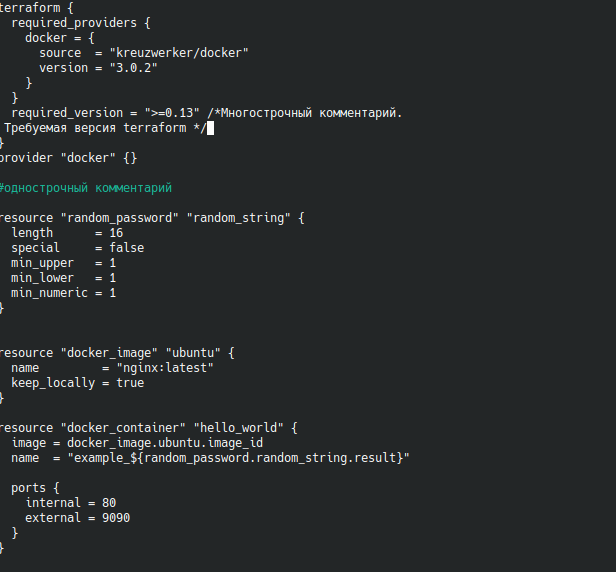

# Terraform01
Terraform01

* Скачайте и установите Terraform версии =1.5.Х

*     Изучите файл .gitignore. В каком terraform-файле, согласно этому .gitignore, допустимо сохранить личную, секретную информацию?

допустимо сохранить личную, секретную информацию в файле personal.auto.tfvars

*  Найдите в state-файле секретное содержимое созданного ресурса random_password, пришлите в качестве
ответа конкретный ключ и его значение.

"result": "86GH2fCRI0WwQv42"

* Раскомментируйте блок кода, примерно расположенный на строчках 29–42 файла main.tf

**docker_image я изменил на ubuntu (какие-то проблемы ,у меня, сo скачиванием образа nginx, хотя ошибку я исправил. Может версию надо было указать?).**
 
Ошибка: отсутствует имя для ресурса. В ресурсе "docker_image" Все блоки ресурсов должны иметь 2 метки (тип, название).

Ошибка: неверное имя ресурса. В ресурсе “docker_container” “1nginx”: Имя должно начинаться с буквы или символа подчеркивания и
может содержать только буквы, цифры, символы подчеркивания и тире. 
«docker_container» «nginx»: 

Ошибка: name = "example_${random_password.random_string_FAKE.resulT}" Управляемый ресурс "random_password" "random_string_FAKE" не был объявлен в корневом модуле.

* Выполните код. В качестве ответа приложите вывод команды docker ps.

* Замените имя docker-контейнера в блоке кода на hello_world

* 
Опасность применения ключа -auto-approve что никто не может изменить нашу инфраструктуру за пределами нашего рабочего процесса Terraform. Это сводит к минимуму риск непредсказуемых изменений и дрейфа конфигурации.-auto-approve Пропускает интерактивное утверждение плана перед применением. Этот параметр игнорируется, когда мы передаем ранее сохраненный файл плана, потому что Terraform считает, что мы передаем файл плана как утверждение, и поэтому никогда не будет запрашивать в этом случае. 

* Уничтожьте созданные ресурсы с помощью terraform

* Объясните, почему при этом не был удалён docker-образ

Так как у нас прописано в файле main.tf keep_locally (логическое значение) true, значит образ Docker не будет удален при операции уничтожения.
